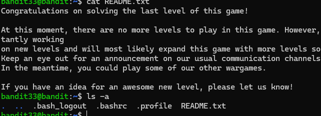

<!-- PROFILE HEADER -->
<h1 align="center" style="font-size: 3em;"> Nermine Kirouane? </h1>
<h3 align="center" style="color: #6e6e6e;">
  💻 Backend Developer | Node.js • Databases • Linux Learner • Ethical Hacker 🛡️
</h3>

 

<!-- TECH STACK ICONS -->

  <!-- HTML -->
  
  
  <!-- CSS -->
  
  
  <!-- JavaScript -->
  

  <!-- Node.js -->
  

  <!-- React -->
  

  <!-- PostgreSQL -->
  

  <!-- C Language -->
  

  <!-- Linux -->
  

  <!-- Bash / CLI / .env -->
  

 

<!-- ABOUT ME -->
<h2 align="center">📌 Who Am I?</h2>

  I'm <strong>Nermine</strong>  an 18-year-old backend warrior building real-world apps with <code>Node.js</code>, <code>PostgreSQL</code>, and <code>Prisma</code>.  
  I'm currently learning Linux, hacking systems (ethically 😉), and working my way to full-stack mastery.  
  I don’t just watch tutorials. I BUILD. I TEST. I BREAK SYSTEMS and LEARN.

 

<!-- CURRENT FOCUS -->
<h2 align="center">🧠 What I'm Learning</h2>

<ul align="center">
  <li>Linux fundamentals (shell, permissions, navigation)</li>
  <li>Security concepts: Bandit wargames, privilege escalation</li>
  <li>ORM mastery with Prisma + PostgreSQL</li>
  <li>Writing scalable backend APIs (RBAC, JWT, bcrypt)</li>
</ul>

  

<!-- CONTACT -->
<h2 align="center">📬 Contact Me</h2>

  > 💌 <strong>Email:</strong> kirouanennermine@gmail.com  
   
  > 🌐 <strong>GitHub:</strong> <a href="https://github.com/hoophopp" target="_blank">github.com/hoophopp</a>

<!---
hoophopp/hoophopp is a ✨ special ✨ repository because its `README.md` (this file) appears on your GitHub profile.
You can click the Preview link to take a look at your changes.
--->
